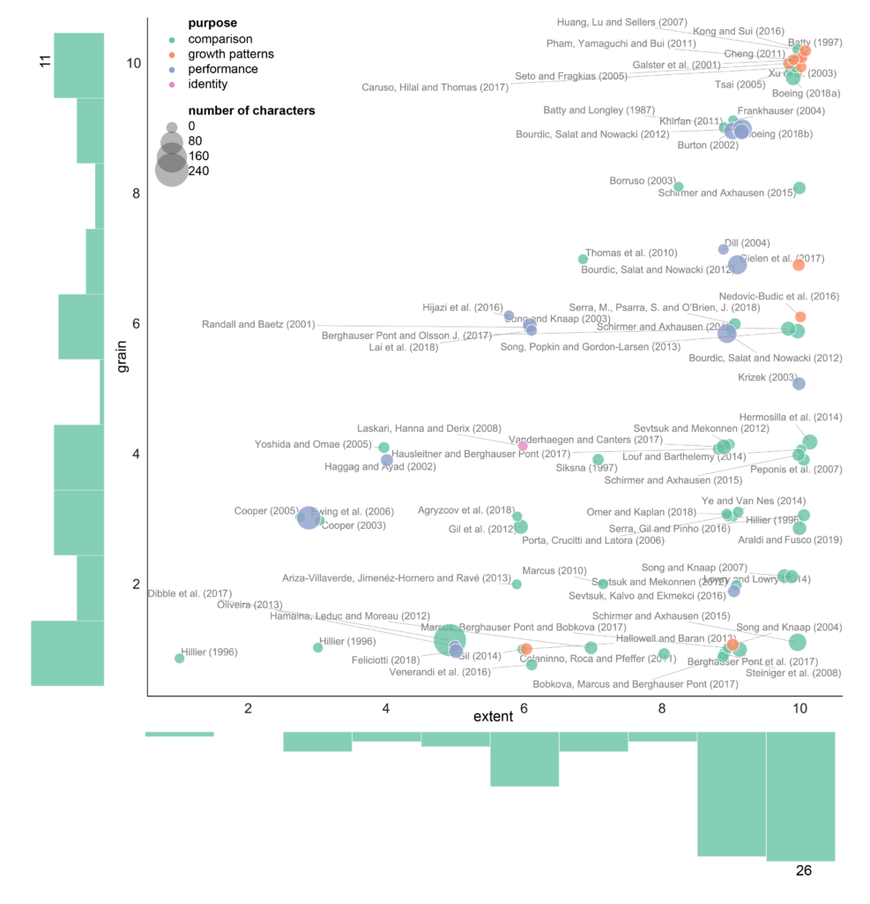

This is a short introduction of our recently published paper _Measuring urban form: Overcoming terminological inconsistencies for a quantitative and comprehensive morphologic analysis of cities_, which is essentially one of the background chapters of my PhD (hopefully finished later this year).

When I started my work, which is focusing on measuring of urban form (or _urban morphometrics_) - see [momepy](http://guide.momepy.org/) - one of the first things I wanted to do was to understand what people were people measuring so far — the natural thing to do. However, I have soon figured out that it would not be so easy as there is a minimal consensus on how to call measurable characters. What one calls _connectivity_ other names _intersection density_ and even then you have a little idea - density based on what? Intersections per hectare, per kilometre? I have collected almost 500 measurable characters to find out that it is one big mess.

Before moving on, I had to do a slight detour trying to understand what all of them were about, which were called differently but were, in fact, the same and which were called the same, but were different things. Both situations happen A LOT. This paper is proposing a 1) framework for naming measurable characters to avoid these cases and 2) classification of characters, to make a more structured sense of the vast number of options we can measure.

Renaming is based on the _Index of Element_ principle. Each character has an _Index_ - the measure that it calculates and _Element_ - the element of urban form that it measures. So the case of _connectivity_ above could be called _a weighted number of intersections_ (Index) _of a pedestrian network_ (Element). Yes, it is longer, but also unambiguous. The room for the interpretation is much narrower than in the previous example.

We have used this principle to rename all of those ~500 characters, which eliminated a lot of duplications, leaving us a bit more than 350 unique ones. At that point, we could continue with a classification, which was the first aim.

Classification of characters, which is loosely used in [momepy](https://docs.momepy.org/en/stable/api.html) as well, categorises characters into six groups based on the nature of the _Index_ part of the name: _dimension, shape, spatial distribution, intensity, connectivity_, and _diversity_. The second layer of classification is based on the notion of scale - what is the grain of the resulting information and the extent of the element. To keep it simple, we are using conceptual S, M, L bins for scale, where _"Small (S) represent- ing the spatial extent of building, plot, street or block (and similar), Medium (M) represent- ing the scale of the sanctuary area, neighbourhood, walkable distance (5 or 10min) or district (and similar) and Large (L), representing the city, urban area, metropolitan area or similar"_ (taken from the paper, p.7). In the end, each character has its category, scale of the grain and scale of the extent. Taking an example of _Closeness Centrality of Street Network_, it falls into connectivity category (as closeness centrality is a network measure), its grain is S because each node has its value, but its extent is L as it can be measured on large networks.

This framework helped us figure out what is the current situation in the field, e.g., that there is a lot of work focusing on dimension, shape, or intensity but very little on diversity (which was surprising as theoretical urban research talks about diversity all the time). Plus a couple of other interesting findings.

Btw, the paper also includes this map of the quantitative research in urban morphology and a complete database of morphometric character we have worked with (also on [GitHub](https://github.com/martinfleis/measuring-urban-form-epb)).

The whole paper of trying to talk inwards to the community, saying _guys, this is a mess, let's do something about it_. We found it fascinating how such a small field as urban morphometrics can produce so much confusion in a way how we use language.

You can find the original paper at [Environment and Planning B website](https://journals.sagepub.com/doi/10.1177/2399808320910444) (open access) or accepted manuscript at the [University of Strathclyde PURE portal](https://pureportal.strath.ac.uk/en/publications/measuring-urban-form-overcoming-terminological-inconsistencies-fo) (open access). There is very little code involved in this. Still, related Jupyter notebooks and CSVs containing the database of literature as well as the database of measurable characters are all in this [GitHub repository](https://github.com/martinfleis/measuring-urban-form-epb).

* * *

Fleischmann, M, Romice, O & Porta, S 2020, 'Measuring urban form: overcoming terminological inconsistencies for a quantitative and comprehensive morphologic analysis of cities', _Environment and Planning B: Urban Analytics and City Science_, pp. 1-18. [https://doi.org/10.1177/2399808320910444](https://doi.org/10.1177/2399808320910444)
