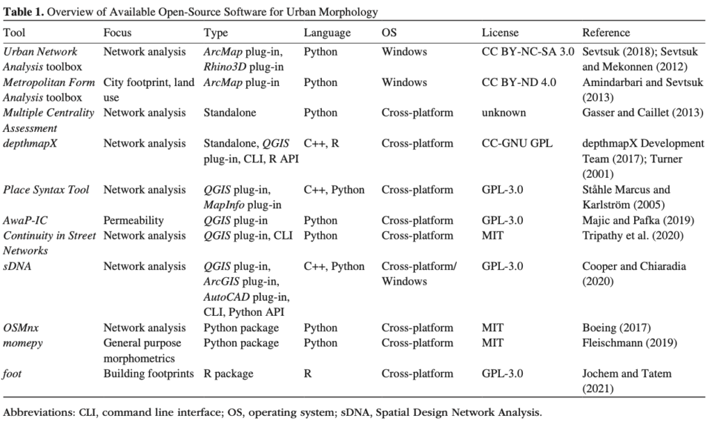
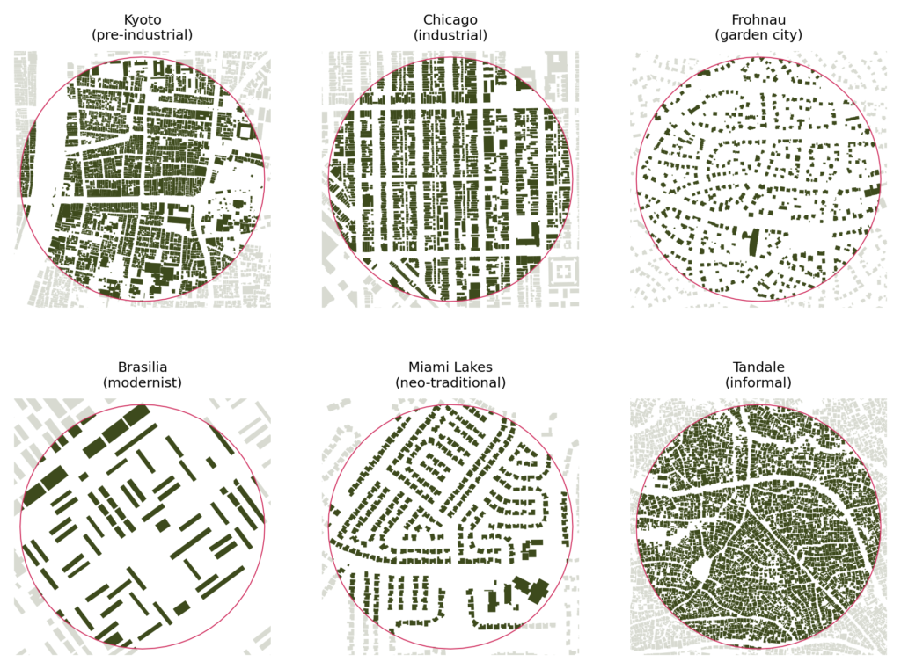
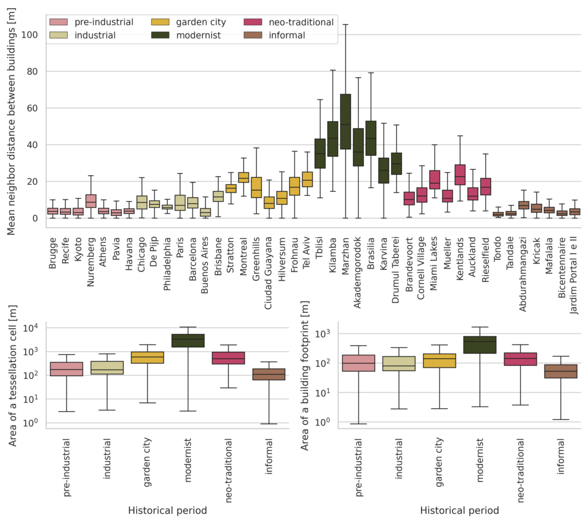

We have [a new paper published in the Geographical Analysis](https://onlinelibrary.wiley.com/doi/full/10.1111/gean.12302#) on the opportunities current developments in geographic data science within the Python ecosystem offer to urban morphology. To sum up - there's a lot to play with and if you're interested in the quantification of urban form, there's no better choice for you at the moment.

Urban morphology (study of urban form) is historically a qualitative discipline that only recently expands into more data science-ish waters. We believe that there's a lot of potential in this direction and illustrate it on the case study looking into the evolution of urban patterns, i.e. how different aspects of urban form has changed over time.

The paper is open access (yay!) (links to [the online version](https://onlinelibrary.wiley.com/doi/full/10.1111/gean.12302#) and a PDF), the research is fully reproducible (even [in your browser thanks to amazing MyBinder](https://mybinder.org/v2/gh/martinfleis/evolution-gean/HEAD)!) with all code on [GitHub](https://github.com/martinfleis/evolution-gean).

## Short summary

We have tried to map all the specialised open-source tools urban morphologists can use these days, which resulted in this nice table. The main conclusion? Most of them are plug-ins for QGIS or ArcGIS, hence depend on pointing and clicking. A tricky thing to reproduce properly.

Table 1 from the paper

We prefer code-based science, so we took the Python ecosystem and put it in the test. We have designed a fully reproducible workflow based on GeoPandas, OSMnx, PySAL and momepy to sample and study 42 places around the world, developed at very different times.

We measured a bunch of morphometric characters (indicators for individual aspects of form) and looked at their change in time. And there is a lot to look at. There are significant differences not only in scale (on the figure below) but in other aspects as well. One interesting observation - it seems that we have forgotten how to make a properly connected, dense grid.

As we said in the paper, "_Switching to a code-based analysis may be associated with a steep learning curve. However, not everyone needs to reach the developer level as the data science ecosystem aims to provide a middle ground user level. That is a bit like Lego—the researcher learns how to put pieces together and then find pieces they need to_build a house_._"

We think that moving from QGIS to Python (or R), as daunting as it may seem to some, is worth it. It helps us overcome the reproducibility crisis science is going through, the crisis caused, among other things, by relying on pointing and clicking too much.

> The open research paradigm, based on open platforms and transparent community-led governance, has the potential to democratize science and remove unnecessary friction caused by the lack of cooperation between research groups while bringing additional transparency to research methods and outputs.
>
> page 18

## Abstract

The recent growth of geographic data science (GDS) fuelled by increasingly available open data and open source tools has influenced urban sciences across a multitude of fields. Yet there is limited application in urban morphology—a science of urban form. Although quantitative approaches to morphological research are finding momentum, existing tools for such analyses have limited scope and are predominantly implemented as plug-ins for standalone geographic information system software. This inherently restricts transparency and reproducibility of research. Simultaneously, the Python ecosystem for GDS is maturing to the point of fully supporting highly specialized morphological analysis. In this paper, we use the open source Python ecosystem in a workflow to illustrate its capabilities in a case study assessing the evolution of urban patterns over six historical periods on a sample of 42 locations. Results show a trajectory of change in the scale and structure of urban form from pre-industrial development to contemporary neighborhoods, with a peak of highest deviation during the post-World War II era of modernism, confirming previous findings. The wholly reproducible method is encapsulated in computational notebooks, illustrating how modern GDS can be applied to urban morphology research to promote open, collaborative, and transparent science, independent of proprietary or otherwise limited software.

_Fleischmann, M., Feliciotti, A. and Kerr, W. (2021), Evolution of Urban Patterns: Urban Morphology as an Open Reproducible Data Science. Geogr Anal. [https://doi.org/10.1111/gean.12302](https://doi.org/10.1111/gean.12302)_
