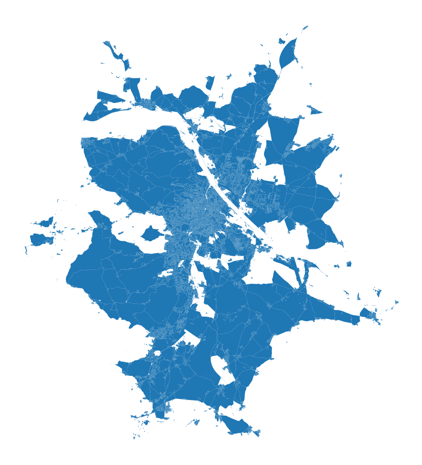
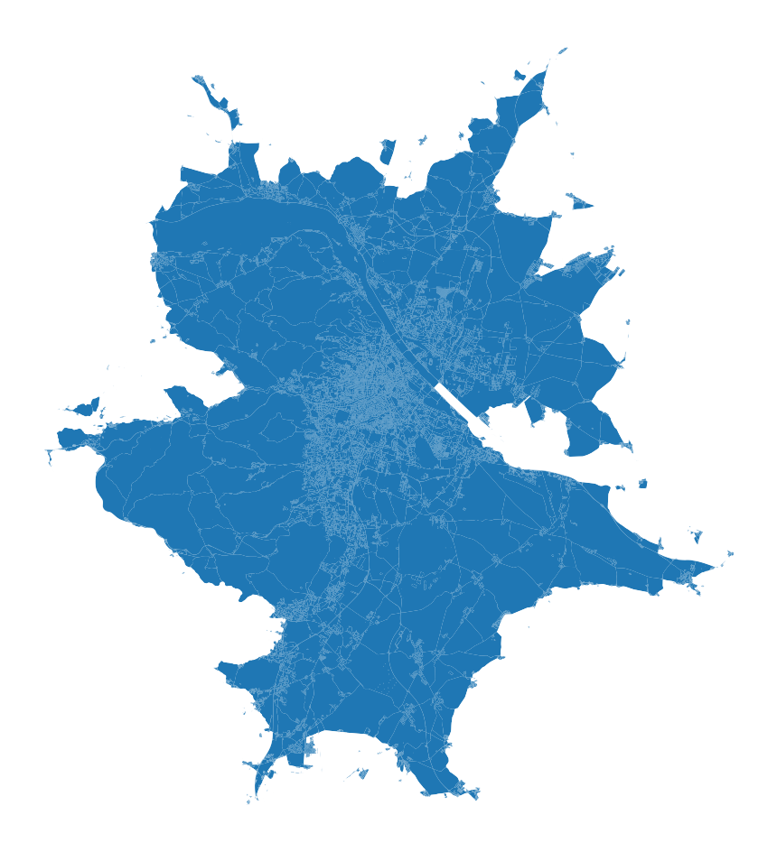

If you ever wanted to polygonize (i.e. create polygons formed from the linework of a set of geometries, as per shapely's definition) something like a street network with [`shapely`](http://shapely.readthedocs.io), you may have noticed missing geometries in the result, like in the case of Vienna below. I had the same issue, and this is a note to myself with a solution.



The result of `shapely.polygonize` with gaps that should not be there.

## polygonize vs polygonize\_full

Shapelyor GEOS, to be precise, so this post _may_ apply to `sf` and friends as well offers two functions for polygonization. One is called simply `polygonize` and returns a collection of resulting geometries. Another, `polygonize_full`, returns the polygons but also all the issues that happened during the process and which did not result in polygons you may expect. However, `polygonize_full` helps you debug the issue but does not solve it.

## noded vs non-noded intersection

When two lines cross, there is a node on both at the point where they intersect, or there is not. The latter is typical for non-planar networks and, in the case of streets, usually represents highway bridges and similar structures. When there is a non-noded intersection, GEOS may have an issue determining the boundary of the enclosed polygon and may eventually fail. That is where the gaps come from.

If you try polygonize in QGIS, you will notice that their first step before the actual polygonization is noding, and the result does not have any gaps. They check the linestring collection and add nodes where the non-noded intersections are first.

## noding

With shapely you can do the same with `shapely.node` function[^1]. Since that only adds nodes within a geometry, we need to merge the whole array of linestrings to a single GeometryCollection first.

[^1]:note that I am talking about shapely 2.0 or newer here

The key part of the workflow looks like this:

```py
linestrings = ... # our geopandas.GeoSeries of linestrings representing street network
collection = shapely.GeometryCollection(linestrings.array)  # combine to a single object
noded = shapely.node(collection)  # add missing nodes
polygonized = shapely.polygonize(noded.geoms)  # polygonize based on an array of nodded parts
polygons = geopandas.GeoSeries(polygonized.geoms)  # create a GeoSeries from parts
```

The result matches the one QGIS gives you, with no missing polygons as shown below.



The output of `shapely.polygonize` based on a properly noded network.

Complete code:

