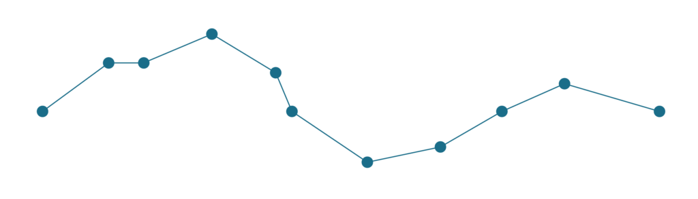
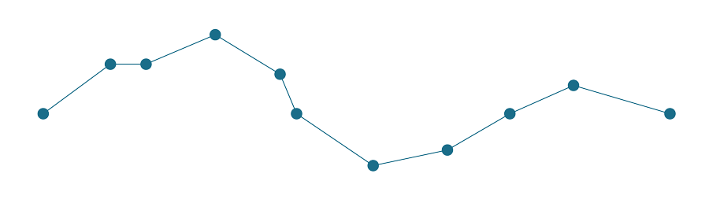
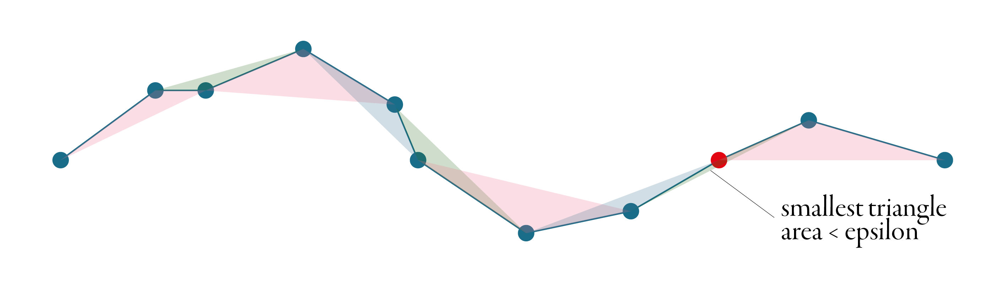

Sometimes our lines and polygons are way too complicated for the purpose. Let's say that we have a beautiful shape of Europe, and we want to make an interactive online map using that shape. Soon we'll figure out that the polygon has too many points, it takes ages to load, it consumes a lot of memory and, in the end, we don't even see the full detail. To make things easier, we decide to **simplify** my polygon.

Simplification means that we want to express the same geometry, using fewer points, but trying to preserve the original shape as much as we can. The easiest way is to open QGIS and use its _Simplify_ processing tool. Now we face the choice - which simplification method should we use? Douglas-Peucker or Visvalingam? How do they work? What is the difference? What does a "_tolerance_" mean?

This short post aims to answer these questions. I'll try to explain both of these most popular algorithms, so you can make proper decisions while using them.

First let's see both how algorithms simplify the following line.



Relatively complex line with 11 points, which needs to be simplified.

## Douglas-Peucker

Douglas-Peucker, or sometimes Ramer–Douglas–Peucker algorithm, is the better known of the two. Its main aim is to identify those points, which are less important for the overall shape of the line and remove them. It does not generate any new point.

The algorithm accepts typically one parameter, tolerance, sometimes called _epsilon_. To explain how is epsilon used, it is the best to start with the principle. Douglas-Peucker is an iterative algorithm - it removes the point, splits the line and starts again until there is no point which could be removed. In the first step, it makes a line between the first and the last points of the line, as illustrated in the figure below. Then it identifies the point on the line, which is the furthest from this line connecting endpoints. If the distance between the line and the point is less than epsilon, the point is discarded, and the algorithm starts again until there is no point between endpoints.


If the distance between the point and the line is larger than epsilon, the first and the furthest points are connected with another line and every point, which is closer than epsilon to this line gets discarded. Every time a new furthest point is identified, our original line splits in two and the algorithm continues on each part separately. The animation below shows the whole procedure of simplification of the line above using the Douglas-Peucker algorithm.



## Visvalingam-Whyatt

Visvalingam-Whyatt shares the aim with Douglas-Peucker - identify points which could be removed. However, the principle is different. Tolerance, or epsilon, in this case, is an area, not a distance.

Visvalingam-Whyatt, in the first step, generates triangles between points, as illustrated in the figure below.



Then it identifies the smallest of these triangles and checks if its area is smaller or larger than the epsilon. If it is smaller, the point associated with the triangle gets discarded, and we start again - generate new triangles, identify the smallest one, check and repeat. The algorithm stops when all generated triangles are larger than the epsilon. See the whole simplification process below.


A great explanation of Visvalingam-Whyatt algorithm with an interactive visualisation made [Mike Bostock](https://bost.ocks.org/mike/simplify/).

## Which one is better?

You can see from the example above, that the final line is the same, but that is not always true, and both algorithms can result in different geometries. Visvalingam-Whyatt tends to produce nicer geometry and is often preferred for simplification of natural features. Douglas-Peucker tends to produce spiky lines at specific configurations. You can compare the actual behaviour of both at [this great example](http://bl.ocks.org/msbarry/9152218) by Michael Barry.

## Which one is faster?

Let's figure it out. I will use a long randomised line and Python package `[simplification](https://github.com/urschrei/simplification)`, which implements both algorithms. The results may vary based on the actual implementation, but using the same package seems fair. I generate randomised line based on 5000 points and then simplify if using both algorithms with the epsilon fine-tuned to return a similar number of points.

```python
import numpy as np
from simplification.cutil import (
    simplify_coords, # this is Douglas-Peucker
    simplify_coords_vw,  # this is Visvalingam-Whyatt
)

# generate coords of 5000 ordered points as a line
coords = np.sort(np.random.rand(5000, 2), axis=0)

# how many coordinates returns DP with eps=0.01?
simplify_coords(coords, .0025).shape
# 30 / 5000

# how many coordinates returns VW with eps=0.001?
simplify_coords_vw(coords, .0001).shape
# 28 / 500

%%timeit
simplify_coords(coords, .0025)

%%timeit
simplify_coords_vw(coords, .0001)
```

And the winner is - Douglas-Peucker. By a significant margin.

Douglas-Peucker:

`74.1 µs ± 1.46 µs per loop (mean ± std. dev. of 7 runs, 10000 loops each)`

Visvalingam-Whyatt:

`2.17 ms ± 23.9 µs per loop (mean ± std. dev. of 7 runs, 100 loops each)`

Douglas-Peucker is clearly more performant, but Visvalingam-Whyatt can produce nicer-looking geometry, pick the one you prefer.

## Percentage instead of epsilon

Some implementations of simplification algorithms do not offer tolerance / epsilon parameter, but ask for a percentage. How many points do you want to keep? One example of this approach is [mapshaper](http://mapshaper.org) by Matthew Bloch. Based on the iterative nature of both, you can figure out how that works :).

## What about topology?

It may happen, that the algorithm (any of them) returns invalid self-intersecting line. Be aware that it may happen. Some implementations (like GEOS used by Shapely and GeoPandas) provide optional slower version preserving topology, but some don't, so be careful.

## I have gaps between my polygons

If you are trying to simplify GeoDataFrame or shapefile, you may be surprised that the simplification makes gaps between the polygons where there should not be any. The reason for that is simple - the algorithm simplifies each polygon separately, so you will easily get something like this.


If you want nice simplification which preserves topology between all polygons, like [mapshaper](http://mapshaper.org) does, look for [TopoJSON](https://github.com/topojson/topojson). Without explaining how that works, as it deserves its own post, see the example below for yourself as the last bit of this text.

```python
import topojson as tp

topo = tp.Topology(df, prequantize=False)
topo.toposimplify(5).to_gdf()
```


If there's something inaccurate or confusing, let me know.
