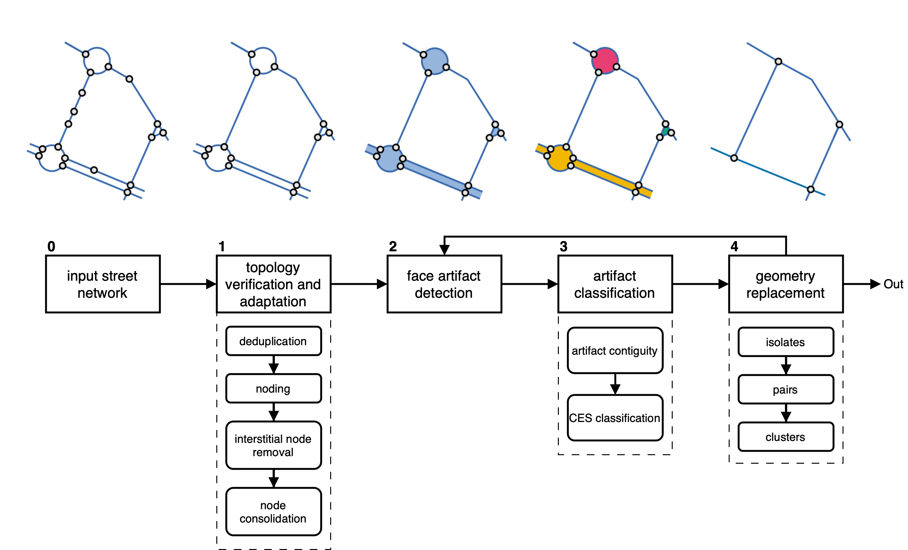

I have been working with street networks for a long time. My first analysis will date probably back to 2017 or so. Most of those focused on the same aspect - understanding the morphology. Yet, practically none of the networks I was able to obtain reflected morphology directly. Rather, they captured transportation networks, with all the detailed intersections, every tiny roundabout, slipway, double carriageway, and so on. Which is pretty annoying when you are interested in a representation of space, not of traffic lines. It bothered me so much that in 2020, I started exploring ways to simplify such transportation networks to morphological ones. And a couple of days ago, we have released a Python package called [`neatnet`](https://uscuni.org/neatnet) That does exactly that.

## The issue

The issue at hand is simple. How to get from complex geometries on the left to the neat geometries on the right.


The solution is not that simple. [Geoff Boeing](https://geoffboeing.com), in his amazing [`OSMnx`](https://osmnx.readthedocs.io) It includes functionality to collapse intersections, which is great, but does not go all the way, while being prone to issues stemming from a fixed bandwidth used for consolidation. [Gareth Simons](https://blog.benchmarkurbanism.com) has done fabulous work in [`cityseer`](https://cityseer.benchmarkurbanism.com), which can do a lot of simplification tasks, but it is a bit cumbersome to use them on a custom data input. [Robin Lovelace](https://www.robinlovelace.net), with colleagues, came up with [`parenx`](https://github.com/anisotropi4/parenx) offering a different take based on buffering and skeletonization / Voronoi, but that one proves hard to scale and occasionally results in a bit wobbly lines. Some folks tried other things, depending occasionally on [OpenStreetMap](https://openstreetmap.org) tags or manual work (believe me, you don't want to simplify a network by hand). None of it made us entirely satisfied. So we tried something else.

## The trick

Five years ago, I thought - _the polygons formed by the network, that are not actual urban blocks, are either long and narrow or too small to be a block_. This thought resulted in a paper with amazing [Anastassia Vybornova](https://github.com/anastassiavybornova) on detection of artefacts of transportation origin in street networks. And once you know where they are, the last step is to simplify them.


## The solution

Together with Anastassia and [James Gaboardi](https://github.com/jGaboardi) (and an enormous help by [Anna Brázdová](https://github.com/Kryndlea) and [Daniela Dančejová](https://github.com/dancejod)), we came up with a set of rules for how to simplify each of the artefacts in the way that affects the underlying network properties, primarily [continuity](https://docs.momepy.org/en/stable/user_guide/graph/coins.html), the least. Which resulted in a single Python function that feels a bit like magic when using it - [`neatnet.neatify()`](https://uscuni.org/neatnet/generated/neatnet.neatify.html). A single line of code takes the input network, detects artefacts, and resolves them based on a rich heuristic derived from the analysis of network continuity. And voila, a _neat_ morphological network is ready for any analysis you may want.


_The diagram illustrating the workflow. See the [paper](https://arxiv.org/abs/2504.16198) for details._

## The software

Everything you need to know is now in the [documentation](https://uscuni.org/neatnet), with the details being in the paper (preprint [here](https://arxiv.org/abs/2504.16198)!). Give it a go and please, please, please let us know if you find any bugs. I am sure there are plenty.

Install with your favourite tool.

```sh
pip install neatnet
pixi add neatnet
conda install neatnet -c conda-forge
```

- [Repository](https://github.com/uscuni/neatnet)
- [Documentation](https://uscuni.org/neatnet)

## The slides

I almost forgot - [here](https://uscuni.org/talks/slides/202504_GISRUK_simplification.html) are some slides from my talk on `neatnet` from GISRUK 2025.

