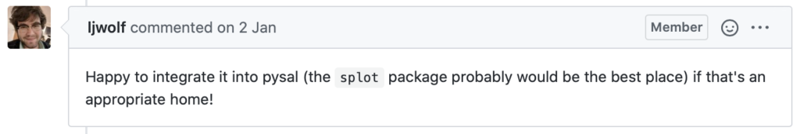

This is a short story of one open-source algorithm and its journey from [QGIS](http://qgis.org) to [mapclassify](http://pysal.org/mapclassify), to be used within [GeoPandas](http://geopandas.org). I am writing it to illustrate the flow within the open-source community because even though this happens all the time, we normally don't talk about it. And we should.

## The story

Sometimes last year, I asked myself a question. How hard would it be to port [topological colouring](https://docs.qgis.org/3.10/en/docs/user_manual/processing_algs/qgis/cartography.html#topological-coloring) tool from QGIS to be used with GeoPandas? Considering that this particular QGIS tool is [written in Python](https://github.com/qgis/QGIS/blob/8a3c7b14c367771d096b4a6d006aa3c4b1017dd5/python/plugins/processing/algs/qgis/TopoColors.py), it seemed to be an easy task.

For those of you who never used it, the aim of topological colouring is to assign colours to (usually) polygons in such a way, that no two adjacent polygons share the same colour (see the illustration in the embedded tweet below).

The adaptation of the Nyall Dawson's original algorithm was quite straightforward, the logic of Python algorithms for QGIS and for GeoPandas is the same. So in October, I have [asked the others](https://github.com/geopandas/geopandas/issues/1165) what would be the ideal way of sharing it.

<https://twitter.com/martinfleis/status/1184219043550650368>

The original license was not compatible with the one we use in GeoPandas and I was not sure if GeoPandas itself is actually the right place for it. So while thinking about it, Nyall himself made the situation easier and offered to relicense the original code.

<https://twitter.com/nyalldawson/status/1184375622748889088>

However, there was no clear consensus what is the best way at that time and the whole idea was set aside, until the end of the year, when I decided to keep it simple and release the script as a tiny Python package. And `[greedy](https://github.com/martinfleis/greedy)` was born.

In the end, greedy offered the original QGIS algorithm for topological colouring and a few other options on top of that, applicable to all geometry types (unlike QGIS, which is limited to polygons). It was a simple solution to release it like that, but it was not optimal, because the more scattered the ecosystem is, the more complicated is to navigate in it and people just easily miss things.

We could have ended the story here, but then Levi Wolf came with an [idea](https://github.com/geopandas/geopandas/issues/1165#issuecomment-570351477).



After some [discussion](https://github.com/pysal/splot/issues/94), `splot` was not seen as the best place, but `mapclassify` was. And after a couple of months, I made a [pull request](https://github.com/pysal/mapclassify/pull/61) merging `greedy` into mapclassify.

It is a very simple story, you may say. Yes, but it shows one thing very clearly, and that is a willingness of the community to collaborate across different projects. A lot of people were involved in it, everyone willing to find the best solution. I think it is worth sharing tiny stories like this.

To see the capability of `mapclassify.greedy`, here is a [Jupyter notebook](https://pysal.org/mapclassify/notebooks/05_Greedy_coloring.html) for you. Thanks everyone involved!

## The Code

This is just a quick appendix to the story, outlining the translation of the code from QGIS to GeoPandas-compatible version.

First thing to say - it is easy! Easier that expected, to be honest. I might have been lucky with the algorithm I've chosen, but I believe that there is a scope for other processing tools to be ported this way.

The code of greedy is [here](https://github.com/pysal/mapclassify/blob/master/mapclassify/greedy.py) and original code [here](https://github.com/qgis/QGIS/blob/8a3c7b14c367771d096b4a6d006aa3c4b1017dd5/python/plugins/processing/algs/qgis/TopoColors.py).

QGIS code has a lot of stuff related to QGIS interface, which can be happily ignored. The core is in `def processAlgorithm(_self_, _parameters_, _context_, _feedback_)` and that is the part we should focus on.

Nyall's code can be roughly divided into three steps (ignoring some interface code):

1. Compute graph to understand topological relationships between polygons
2. Compute balanced topological colouring
3. Assign colours to features

To compute graph, Nyall defines a new class holding the topology and checks which polygons intersect with which. I did not want to have a specific class, because we have `libpysal`'s [weights](https://pysal.org/libpysal/generated/libpysal.weights.W.html#libpysal.weights.W) object taking care of it. Moreover, it comes with an alternative option of topology inferring as [contiguity weights](https://pysal.org/libpysal/api.html#contiguity-weights). No need to expensively compute intersections anymore (unless we want to, I kept the option there).

Balanced colouring is, in the end, the only part of the code, which is almost entirely original. I made only a few modifications.

Because topological colouring is a know Graph problem, there is a selection of algorithms in `networkx` library dealing with the problem, so I just simply linked them in.

Finally, the function now returns `pandas.Series`, making it simple to assign resulting values to GeoDataFrame. The most simple usage is then a single line.

```python
gdf['colors'] = mapclassify.greedy(gdf)
```
